<div align="center">
  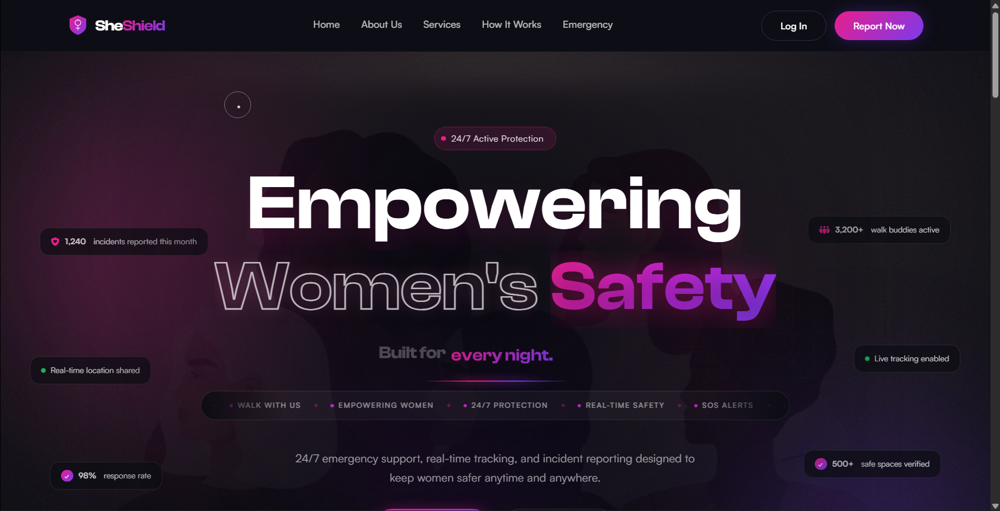
  <br><br>
  <h1>🛡️ SheShield</h1>
  <h3>Empowering Women's Safety Through Technology</h3>
  <p><em>24/7 emergency support, real-time tracking, incident reporting, and community-driven protection — all in one platform.</em></p>
  <br>
  <a href="#-key-features">Features</a> •
  <a href="#-screenshots">Screenshots</a> •
  <a href="#-tech-stack">Tech Stack</a> •
  <a href="#-installation">Installation</a> •
  <a href="#-project-structure">Structure</a> •
  <a href="#-security">Security</a> •
  <a href="#-roadmap">Roadmap</a>
</div>

---

## 🌟 About SheShield

**SheShield** is a comprehensive women's safety platform built with a premium, glassmorphic dark-mode UI. It combines real-time emergency response, community-driven escort services, incident reporting with heat-map visualization, and a safety chatbot assistant — all designed to create a safer environment for women on campuses and beyond.

> *"Technology that protects, empowers, and transforms lives."*

The platform features a fully responsive design powered by custom fonts (Clash Display, Satoshi), GSAP scroll animations, Lenis smooth scrolling, and a modular PHP backend with MySQL database integration and PHPMailer-based email notifications.

---

## ✨ Key Features

### 🆘 Emergency SOS System
- **One-tap emergency alerts** with live GPS location sharing
- Instant notification to registered emergency contacts via SMS and email
- Silent alarm mode for discreet signaling
- Real-time tracking and status updates during emergencies
- Works offline with limited connectivity fallback

### 📝 Incident Reporting
- Secure incident reporting with **photo and location evidence**
- Anonymous reporting option for user safety
- Predefined campus locations (Block 32, Girls Hostel, Library, etc.)
- Case tracking with real-time status updates
- Integration with safety heat maps for pattern analysis

### 👣 Walk With Us
- Request **verified volunteer walkers** for safe campus escorts
- Dropdown-based pickup/destination selection matching campus locations
- Availability scheduling with preferred time selection
- **Branded email confirmations** sent to both requester and walker
- Walker registration system with area preference selection
- Live walker count showing active volunteers nearby

### 💬 Safety Chatbot Assistant
- Floating chatbot widget on the landing page (bottom-right)
- **6 predefined quick-reply topics** covering incident reporting, SOS usage, Walk With Us, data privacy, emergency contacts, and safe spaces
- Animated message bubbles with typing delay simulation

### 🗺️ Safety Heat Map & Safe Spaces
- Interactive heat map powered by community-reported incident data
- Real-time area safety analysis with color-coded danger zones
- Verified women-friendly establishments, shelters, and police stations
- Interactive map with directions and contact details

### 📊 Premium Dashboard
- Glassmorphic dark-mode UI with gradient accents
- Personalized safety statistics and analytics
- Incident history tracking and complaint management
- Emergency contact management
- Walk request history and active walk status
- Settings panel with profile customization

---

## 💻 Tech Stack

<div align="center">
  <table>
    <tr>
      <td align="center"><strong>Frontend</strong></td>
      <td align="center"><strong>Backend</strong></td>
      <td align="center"><strong>Libraries & APIs</strong></td>
      <td align="center"><strong>DevOps</strong></td>
    </tr>
    <tr>
      <td>
        • HTML5 / CSS3<br>
        • Vanilla JS (ES6+)<br>
        • TailwindCSS<br>
        • Custom Fonts (Clash Display, Satoshi)<br>
        • Glassmorphism Design System<br>
      </td>
      <td>
        • PHP 7.4+<br>
        • MySQL / MySQLi<br>
        • RESTful API Architecture<br>
        • MVC Pattern<br>
        • Session-based Auth<br>
      </td>
      <td>
        • GSAP 3.12 + ScrollTrigger<br>
        • Lenis Smooth Scroll<br>
        • VanillaTilt.js<br>
        • PHPMailer (SMTP)<br>
        • Geolocation API<br>
        • Font Awesome 6.5<br>
      </td>
      <td>
        • Git / GitHub<br>
        • XAMPP (Local Dev)<br>
        • Apache Server<br>
        • MySQL Workbench<br>
      </td>
    </tr>
  </table>
</div>

---

## 📸 Screenshots

### Landing Page
Premium glassmorphic hero with animated headline, morphing text ("Built for every woman / every night / every campus"), horizontal ticker, and gradient CTAs.

<div align="center">
  
</div>

---

### Safety Services — Honeycomb Grid
Hexagonal honeycomb layout showcasing all 6 core safety features with glowing borders and hover effects.

<div align="center">
  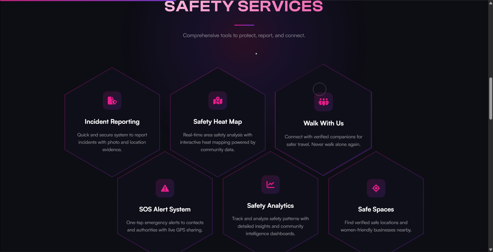
</div>

---

### How It Works — Timeline
Vertical timeline with animated pulse nodes showing the 4-step onboarding process.

<div align="center">
  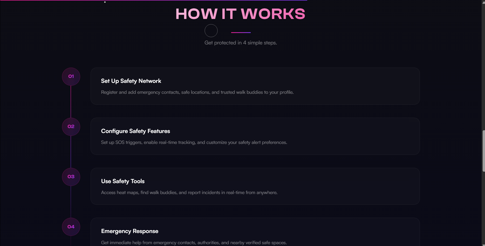
</div>

---

### About SheShield
About section with marquee banner, team description, and glassmorphic content cards.

<div align="center">
  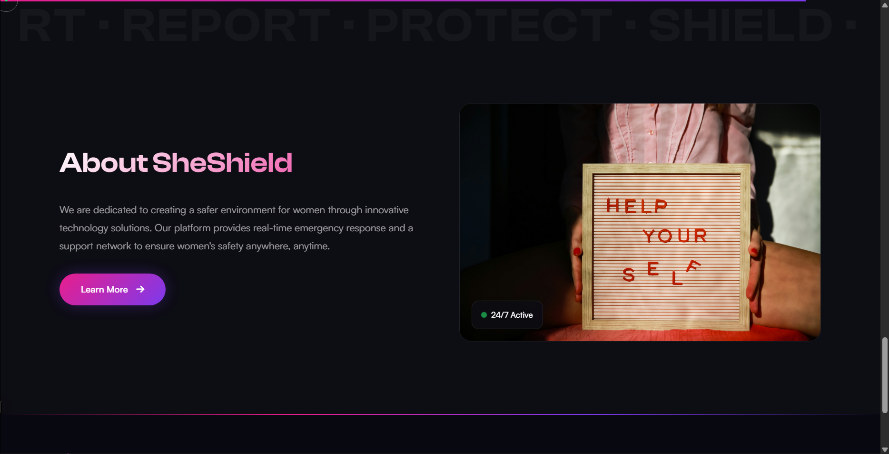
</div>

---

### Sign In
Secure login page with glassmorphic form, gradient accents, and session-based authentication.

<div align="center">
  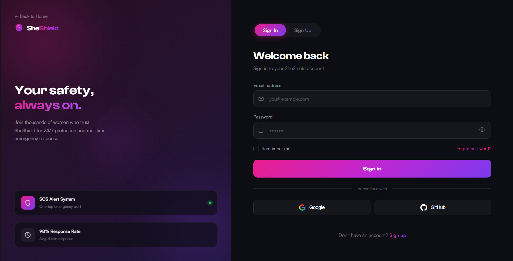
</div>

---

### Dashboard
Glassmorphic dashboard with safety stats, recent activity, and quick-action cards.

<div align="center">
  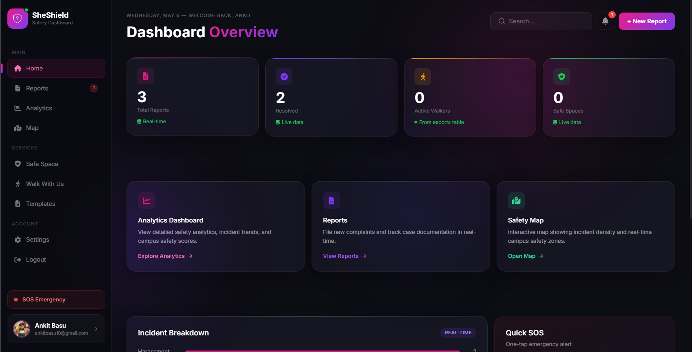
</div>

---

### Incident Reporting
Report form with location dropdown, incident type selector, photo upload, and anonymous mode.

<div align="center">
  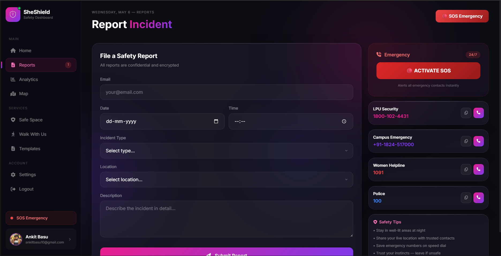
</div>

---

### Safety Analytics
Detailed analytics with safety patterns, response metrics, and community intelligence visualizations.

<div align="center">
  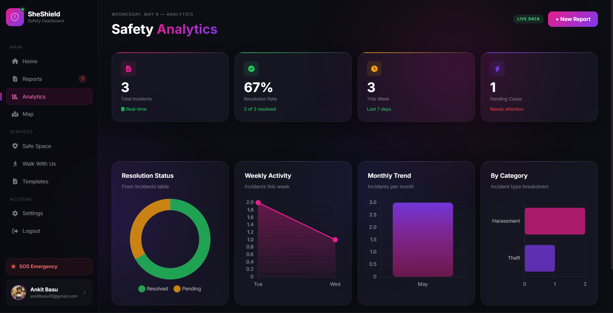
</div>

---

### Walk With Us
Side-by-side forms for requesting a walk (with campus location dropdowns) and volunteering as a walker.

<div align="center">
  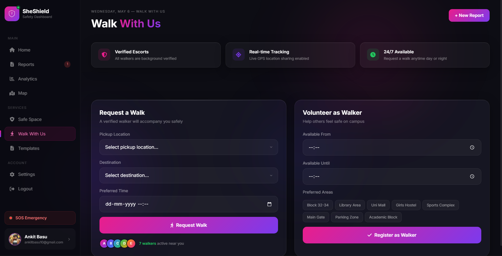
</div>

---

### Safety Heat Map
Interactive heat map visualization of reported incidents across the campus.

<div align="center">
  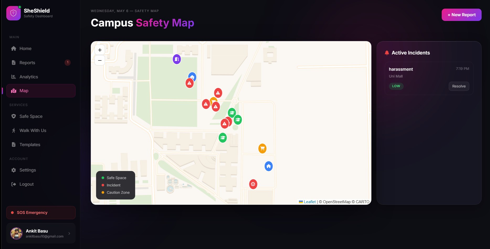
</div>

---

### Safe Spaces
Verified safe locations including shelters, police stations, and women-friendly businesses with interactive map.

<div align="center">
  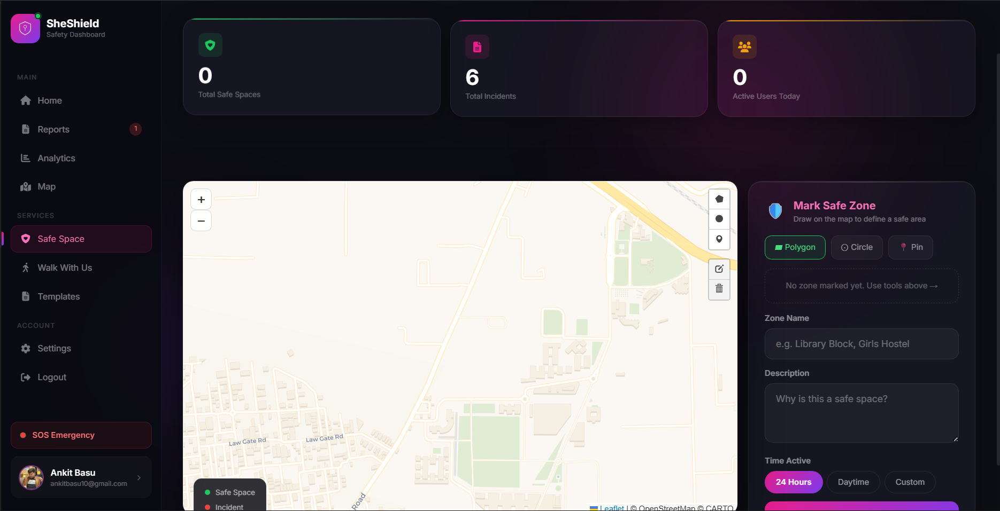
</div>

---

### Complaints & Case Management
Track and manage reported incidents with status updates, resolution tracking, and case history.

<div align="center">
  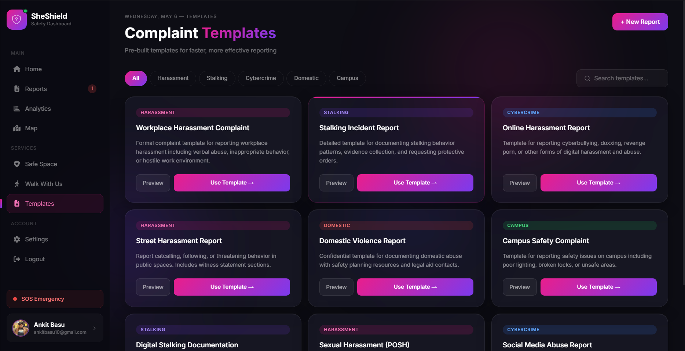
</div>

---

## 🚀 Installation

### Prerequisites
- **PHP** 7.4 or higher
- **MySQL** 5.7 or higher
- **XAMPP** / **WAMP** / **MAMP** (or any Apache + MySQL stack)
- **PHPMailer** (included in `/PHPMailer/`)
- Gmail account with App Password for SMTP email

### Quick Setup

```bash
# 1. Clone the repository
git clone https://github.com/Ankit-Basu/SheShield-.git
cd SheShield-

# 2. Place in your web server's document root
# For XAMPP: copy to C:/xampp/htdocs/sheshield/

# 3. Import the database
# Open phpMyAdmin → Import → Select database/mysqli_db.php
# The database auto-creates tables on first run

# 4. Configure email (for Walk With Us notifications)
cp app/config/email_config.example.php app/config/email_config.php
# Edit email_config.php with your Gmail + App Password

# 5. Access the application
# Landing page: http://localhost/sheshield/pro/landing.html
# Dashboard:    http://localhost/sheshield/views/pages/dashboard.php
```

### Email Configuration

```php
// app/config/email_config.php
define('SMTP_HOST', 'smtp.gmail.com');
define('SMTP_USERNAME', 'your-email@gmail.com');
define('SMTP_PASSWORD', 'your-app-password');  // Google App Password
define('SMTP_PORT', 587);
define('SMTP_ENCRYPTION', 'tls');
define('DEFAULT_FROM_EMAIL', 'your-email@gmail.com');
define('DEFAULT_FROM_NAME', 'SheShield');
```

---

## 📋 Project Structure

```
SheShield/
├── api/                    # RESTful API endpoints
│   ├── auth/               # Login, signup, session verification
│   ├── incidents/          # Incident CRUD operations
│   └── walks/              # Walk request & walker registration APIs
│       ├── request_walk.php
│       └── send_walk_email.php   # Branded email sender
├── app/
│   ├── config/             # Email config, database config
│   ├── controllers/        # Business logic controllers
│   ├── middleware/          # Session bootstrap, auth middleware
│   └── models/             # Database connection (mysqli_db.php)
├── auth/                   # Authentication handlers
│   ├── simple_login.php    # Login with session management
│   └── signup.php          # User registration
├── pro/                    # Premium landing page
│   ├── landing.html        # Main landing page (glassmorphic UI + chatbot)
│   ├── css/premium.css     # Design system (1300+ lines)
│   └── js/premium.js       # GSAP animations, morph text, interactions
├── views/pages/            # Dashboard pages (PHP)
│   ├── dashboard.php       # Main dashboard
│   ├── report.php          # Incident reporting form
│   ├── walkwithus.php      # Walk request + volunteer registration
│   ├── analytics.php       # Safety analytics & insights
│   ├── sidebar.php         # Navigation sidebar component
│   ├── settings.php        # User settings
│   └── toast.php           # Toast notification component
├── PHPMailer/              # PHPMailer library
├── public/css/             # Dashboard CSS (dashboard.css)
├── screenshots/            # Application screenshots
├── database/               # Database schema & connection
├── fonts/                  # Custom fonts (Clash Display, Satoshi)
└── README.md               # This file
```

---

## 🔒 Security

| Layer | Implementation |
|-------|---------------|
| **Authentication** | Session-based auth with `password_hash()` / `password_verify()` |
| **Session** | Custom session bootstrap with secure cookie settings |
| **Database** | Prepared statements (MySQLi) to prevent SQL injection |
| **Input** | Server-side validation and `htmlspecialchars()` sanitization |
| **Email** | SMTP with TLS encryption via PHPMailer |
| **Privacy** | Anonymous incident reporting, no third-party data sharing |
| **Config** | Sensitive credentials in `.gitignore`-protected config files |

---

## 🗺️ Roadmap

- [x] Premium glassmorphic landing page with GSAP animations
- [x] Honeycomb grid for Safety Services section
- [x] Vertical timeline for How It Works section
- [x] Morphing hero text animation
- [x] Floating chatbot with predefined safety Q&A
- [x] Walk With Us — branded email notifications
- [x] Walker registration with email confirmation
- [x] Campus location dropdowns (matching report locations)
- [x] Safety analytics dashboard
- [x] Complaint management system
- [ ] Native mobile app (React Native)
- [ ] AI-powered chatbot with NLP
- [ ] Push notifications for SOS alerts
- [ ] Wearable device integration
- [ ] Multi-language support
- [ ] Admin dashboard for moderation

---

## 👥 Team

Built with dedication by students passionate about women's safety and modern web development.

## 📄 License

This project is licensed under the **MIT License** — see the [LICENSE](LICENSE) file for details.

## 🤝 Contributing

We welcome contributions! Here's how:

1. Fork the repository
2. Create a feature branch (`git checkout -b feature/amazing-feature`)
3. Commit your changes (`git commit -m 'Add amazing feature'`)
4. Push to the branch (`git push origin feature/amazing-feature`)
5. Open a Pull Request

---

<div align="center">
  <strong>🛡️ SheShield — Safety. Support. Empowerment.</strong>
  <br>
  <sub>Built with ❤️ for every woman, every night, every journey.</sub>
</div>
